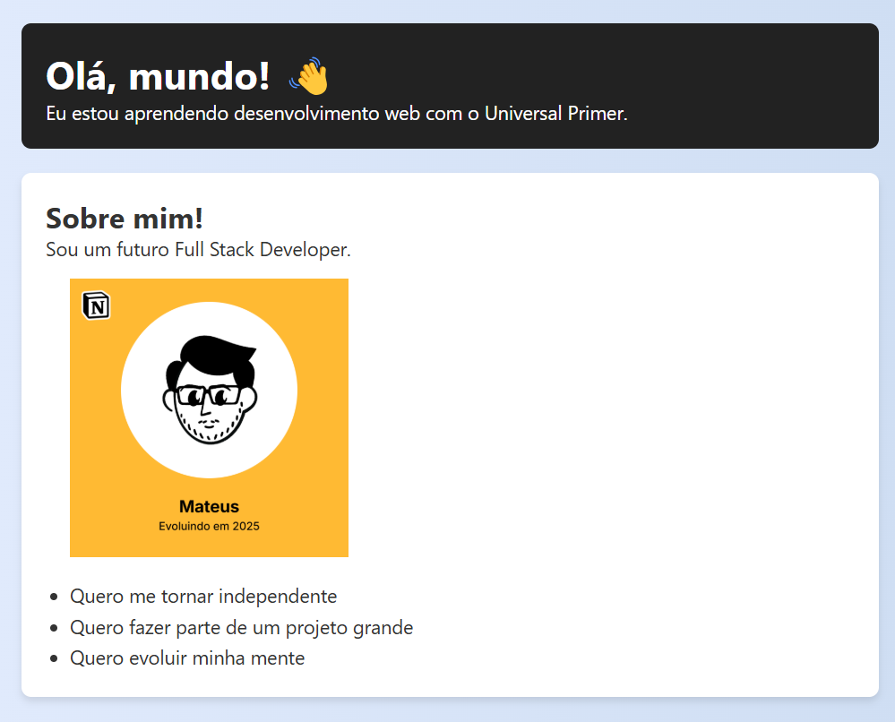

<!-- markdownlint-disable MD033 -->
# Projeto de Teste com HTML/CSS

Este projeto foi criado como parte de uma plano de estudos Full Stack com foco no futuro como Engenheiro na área **Desktop Platform**.

## Como rodar

1. Baixe ou clone este repositório:

   ```sh
   git clone https://github.com/mateusaraujos/projeto-html-css
   ```

2. Abra a pasta do projeto no seu computador.
3. Clique duas vezes no arquivo `index.html` ou abra-o no seu navegador preferido.

## Print da interface

Veja como está a interface do projeto:

<p align="center">
  
</p>

## Tecnologias usadas

- HTML5
- CSS3
- Flexbox
- CSS Grid
- Git
- GitHub

## Veja ao vivo

[](https://mateusaraujos.github.io/projeto-html-css/)

[](https://projeto-html-css-umber.vercel.app)

## Feito por

[](https://www.linkedin.com/in/mateusaraujos/)
